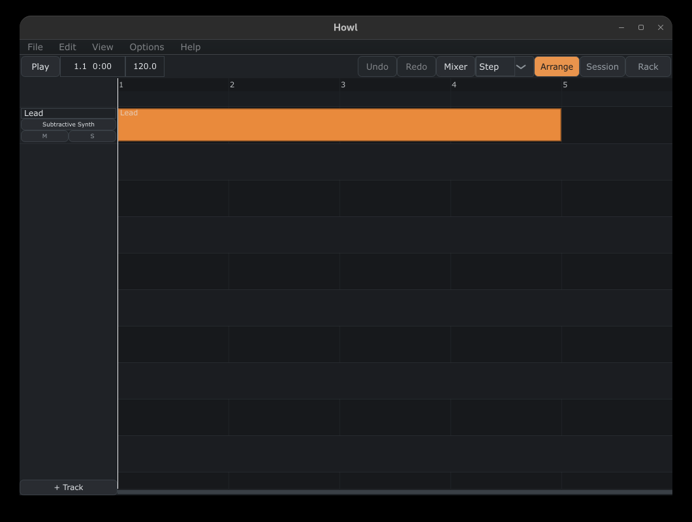

# Howl



Howl is a digital audio workstation written in C++20 on the JUCE 8 framework. It covers the core of what a DAW needs, a timeline, a piano roll, a session grid, a mixer, plugin hosting, and clean offline rendering while supporting VST3.

## Features

- Arrangement timeline with MIDI and audio tracks, clip editing, zoom, a loop region, and seek
- Session view with a clip launch grid and quantized scene launching
- Piano roll note editing with full undo and redo
- Mixer with per track gain, pan, mute, solo, effect chains, sends, buses, and plugin delay compensation
- Built in effects: equalizer, compressor, limiter, delay, reverb, and gain
- Built in subtractive synthesizer
- VST3 and CLAP plugin hosting behind one shared adapter interface
- Track freezing, heavy tracks bounce to audio and play back from the frozen render
- Audio warping through the Rubber Band time stretcher
- Instrument parameter automation lanes evaluated during playback
- WAV import and 24 bit WAV export through a deterministic offline renderer
- Recent files and an audio device settings dialog
- Autosave with crash recovery and unsaved changes guards
- Project save and load as plain JSON text (.howl files)

## Building

You need CMake 3.22 or newer, Ninja, and a C++20 compiler. All dependencies (JUCE 8.0.4, Catch2 Testing Framework, CLAP, Rubber Band) are fetched and pinned automatically by CMake

```
cmake -B build -G Ninja
cmake --build build
```

The app target is `Howl`.

You are able to run the app's binary from build/src/app/Howl_artefacts

## Tests

```
ctest --test-dir build
```

Unit tests cover the audio engine, the mixer, DSP, plugin adapters, serialization, and golden render checks that ensure offline output is deterministic

## Shortcuts

| Key | Action |
| --- | --- |
| Space | Play / stop |
| Tab | Cycle Arrange / Session / Rack view |
| M | Toggle mixer |
| B | Toggle browser |
| Home | Rewind to the start |
| Ctrl+Z / Ctrl+Y | Undo / redo |
| Ctrl+N / Ctrl+O | New / open project |
| Ctrl+S / Ctrl+Shift+S | Save / save as |
| Delete | Remove the current selection |
| Ctrl+D | Duplicate selected notes (piano roll) |
| Left / Right | Nudge selected notes (piano roll) |
| Up / Down | Transpose selected notes by a semitone, Shift for an octave (piano roll) |
| Alt+click | Slice a note (piano roll) |
| Ctrl+drag | Marquee select (piano roll), duplicate a clip (arrange view) |


## Documentation

- [High level architecture](docs/architecture.md)
- [Low level internals](docs/internals.md)
- [Operation sequences](docs/sequences.md)
- [Class reference](docs/classes.md)

## License

GPL 3.0 or later.
