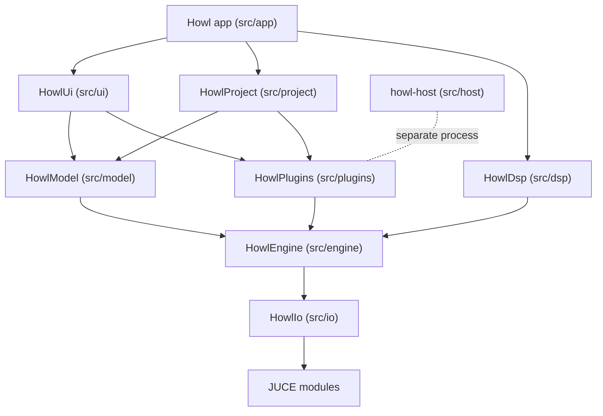

# High level architecture

Howl is organized as a stack of static libraries, each one a folder under `src/`, with a thin app target on top. Lower layers never know about the layers above them, so the audio engine can be built and tested with no UI at all.

## Module stack

## What each layer does

**core** (headers only). Fundamental types shared by everything: `SampleCount`, `AudioBlock`, and a fixed capacity `LockFreeQueue` used to pass messages from the UI thread to the audio thread.

**io** (`HowlIo`). Talks to the outside world. `AudioDevice` owns the system audio output and drives the audio callback. `AudioFile` reads and writes WAV data through the JUCE format readers. `MidiInputHub` opens every connected MIDI device and queues incoming notes for the audio thread and control changes for the message thread.

**engine** (`HowlEngine`). The abstract audio machinery. `Node` is the interface every processor implements, `Graph` owns nodes and runs them in topological order, `Transport` holds play state, tempo, position, and the loop region in atomics so both threads can read it safely. `Instrument` and `Effect` are the interfaces every sound source and processor implement, and `EffectChain` runs an ordered list of effects.

**dsp** (`HowlDsp`). Concrete sound. The subtractive synthesizer, the one shot sampler, the built in effects (equalizer, compressor, limiter, delay, reverb, gain), an envelope follower, and an offline time stretcher wrapping the Rubber Band library for audio warping.

**plugins** (`HowlPlugins`). Third party plugin hosting. `IPluginInstance` is a format neutral interface; `Vst3Adapter` and `ClapAdapter` implement it for their formats, and `SandboxedPluginInstance` implements it by driving a plugin loaded in a separate child process. `PluginInstrument` and `PluginEffect` wrap a plugin instance so the rest of the app treats plugins exactly like built in instruments and effects. `PluginHost` scans the system for plugins on a background thread and caches the result to disk.

**host** (`howl-host`). A small separate binary that loads one plugin on behalf of the app. Audio crosses between the processes through shared memory, control messages travel as JSON lines over pipes. When a plugin crashes it takes this process down, not Howl.

**model** (`HowlModel`). The document and its playback. `Arrangement` holds tracks, clips, and automation lanes. `Session` holds the clip launch grid. `PatternBank` holds patterns (one MIDI clip per track) and their placements on the timeline's pattern lane. `ArrangementNode` is the single engine node that renders the whole project: one renderer per track, a mixer, frozen track buffers, session players, and the sample preview player. Edits go through `Command` objects on a `CommandStack`, which gives every mutation undo and redo for free; the stack's change counter also drives dirty tracking for autosave and the unsaved changes guards. `SnapGrid` holds the pure tick rounding functions behind the global snap setting.

**project** (`HowlProject`). Serialization. `ProjectSerializer` turns the whole session into `.howl` JSON text and back, including plugin state blobs, patterns, automation, and MIDI mappings.

**ui** (`HowlUi`). JUCE components. `MainComponent` is the single window shell: transport bar on top, a file browser column on the left when shown, then track headers beside the center view, which cycles between the arrange timeline, the session grid, and the channel rack. A swappable bottom panel holds the piano roll, the mixer, or the automation editor. Every color comes from one theme header applied through a shared LookAndFeel.

**app**. `Main.cpp` wires everything together: opens the device, builds the graph, connects UI callbacks to model commands, runs the autosave timer, keeps the recent files and audio device settings, and owns the file dialogs for open, save, import, and export.

## Threading and process model

Three kinds of threads exist, plus one kind of child process:

1. **The message thread.** All UI, all edits, all file dialogs. Model mutations happen here through commands. Timers on this thread drain the MIDI control change queue, mirror mixer state into the UI, collect preview player garbage, and write autosaves.
2. **The audio thread.** Calls `Graph::process` once per block. Code on this path never allocates, never locks, never touches files, and never throws. It reads shared state through atomics and receives requests through lock free queues.
3. **Worker threads.** The plugin scanner runs on its own thread and caches results to disk. Offline jobs like track freezing, audio warping, and WAV export pause the device first, then render on the message thread, so they never race the audio callback.
4. **Sandbox child processes.** One `howl-host` process per sandboxed plugin. The audio thread exchanges blocks with it through shared memory under a bounded wait, so a hung or dead child costs at most a fixed budget before the plugin is bypassed.

An `XrunWatcher` polls the device for buffer underruns so regressions in real time safety show up during development instead of in a recording.
