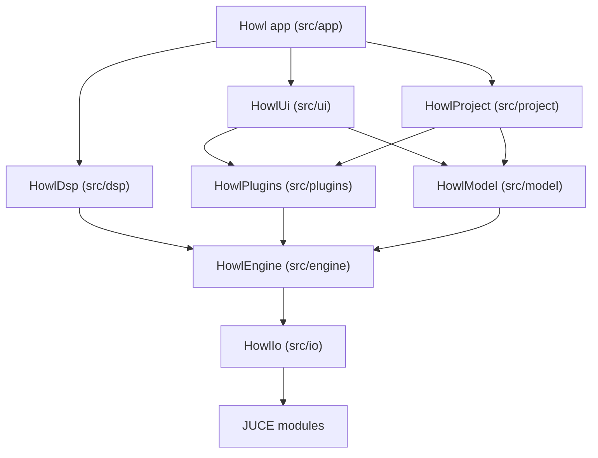

# High level architecture

Howl is organized as a stack of static libraries, each one a folder under `src/`, with a thin app target on top. Lower layers never know about the layers above them, so the audio engine can be built and tested with no UI at all.

## Module stack

## What each layer does

**core** (headers only). Fundamental types shared by everything: `SampleCount`, `AudioBlock`, and a fixed capacity `LockFreeQueue` used to pass messages from the UI thread to the audio thread.

**io** (`HowlIo`). Talks to the outside world. `AudioDevice` owns the system audio output and drives the audio callback. `AudioFile` reads and writes WAV data through the JUCE format readers.

**engine** (`HowlEngine`). The abstract audio machinery. `Node` is the interface every processor implements, `Graph` owns nodes and runs them in topological order, `Transport` holds play state, tempo, position, and the loop region in atomics so both threads can read it safely. `Instrument` and `Effect` are the interfaces every sound source and processor implement, and `EffectChain` runs an ordered list of effects.

**dsp** (`HowlDsp`). Concrete sound. The subtractive synthesizer, the built in effects (equalizer, compressor, limiter, delay, reverb, gain), an envelope follower, and an offline time stretcher wrapping the Rubber Band library for audio warping.

**plugins** (`HowlPlugins`). Third party plugin hosting. `IPluginInstance` is a format neutral interface; `Vst3Adapter` and `ClapAdapter` implement it for their formats. `PluginInstrument` and `PluginEffect` wrap a plugin instance so the rest of the app treats plugins exactly like built in instruments and effects. `PluginHost` scans the system for plugins on a background thread and caches the result to disk.

**model** (`HowlModel`). The document and its playback. `Arrangement` holds tracks, clips, and automation lanes. `Session` holds the clip launch grid. `ArrangementNode` is the single engine node that renders the whole project: one renderer per track, a mixer, frozen track buffers, and session players. Edits go through `Command` objects on a `CommandStack`, which gives every mutation undo and redo for free.

**project** (`HowlProject`). Serialization. `ProjectSerializer` turns the whole session into `.howl` JSON text and back, including plugin state blobs.

**ui** (`HowlUi`). JUCE components. `MainComponent` is the single window shell: transport bar on top, arrange view or session view in the center, track headers on the left, and a swappable bottom panel holding the piano roll, the mixer, or the automation editor.

**app**. `Main.cpp` wires everything together: opens the device, builds the graph, connects UI callbacks to model commands, and owns the file dialogs for open, save, import, and export.

## Threading model

Three kinds of threads exist:

1. **The message thread.** All UI, all edits, all file dialogs. Model mutations happen here through commands.
2. **The audio thread.** Calls `Graph::process` once per block. Code on this path never allocates, never locks, never touches files, and never throws. It reads shared state through atomics and receives requests through the lock free queue.
3. **Worker threads.** The plugin scanner runs on its own thread and caches results to disk. Offline jobs like track freezing and WAV export pause the device first, then render on the message thread, so they never race the audio callback.

An `XrunWatcher` polls the device for buffer underruns so regressions in real time safety show up during development instead of in a recording.

## The audio path in one paragraph

The device calls back with a block. The graph runs its nodes in order, which today means one `ArrangementNode`. That node drains the launch queue, then renders every track into its own scratch buffer: frozen tracks copy from their prerendered audio, session tracks play their launched clip, and everything else renders from the arrangement timeline. MIDI tracks evaluate their automation lanes, push note events into their instrument, and let it render; audio tracks read warped sample data. The mixer then runs each track strip (effects, delay compensation, gain, pan, mute, solo), sums into buses and the master strip, runs the master chain, and the result leaves through the device.
