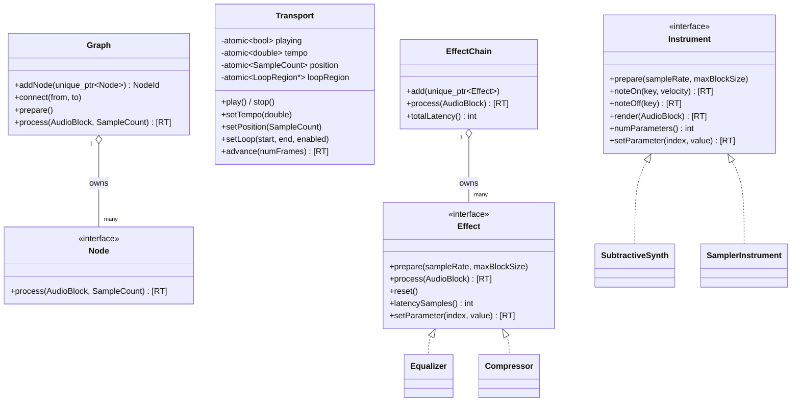
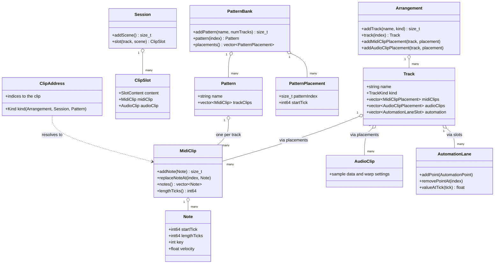
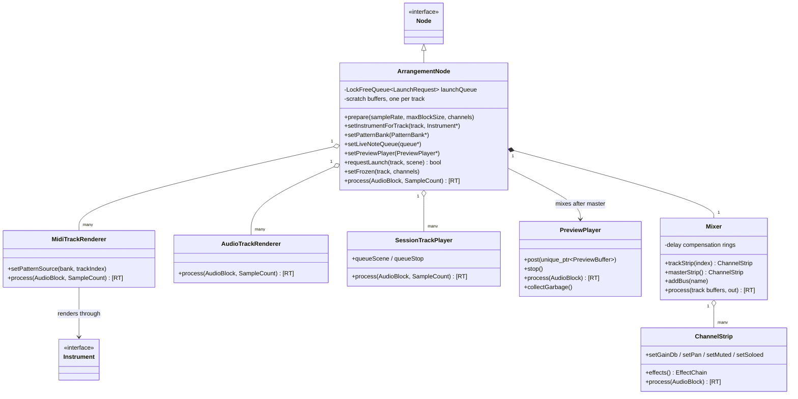
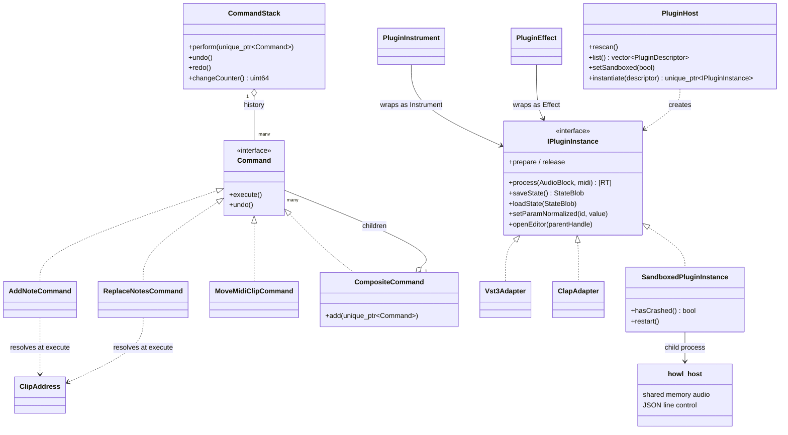

# Class diagrams

Four diagrams, one per area. Methods are trimmed to the ones that explain each class's job. `[RT]` marks methods that run on the audio thread.

## Engine interfaces

Everything that makes sound implements one of these. The rest of the app programs against the interface and never cares what is behind it.

## The document model

Plain data with tick positions. No JUCE types, no engine types, which keeps it easy to test and serialize.

## Playback and mixing

`ArrangementNode` is the bridge between the document above and the engine interfaces. It is the only engine node the app needs.

## Commands and plugins

Left side: every edit is a command, so the stack can walk history in both directions. Right side: both plugin formats hide behind one interface, then get wrapped to look like native instruments and effects; the sandboxed instance is a third implementation that puts a whole process behind the same interface.

