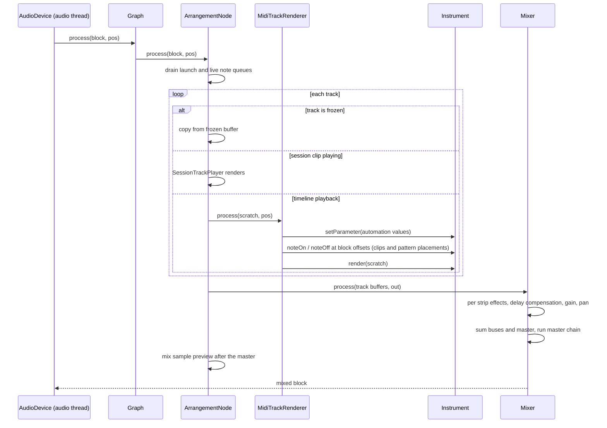
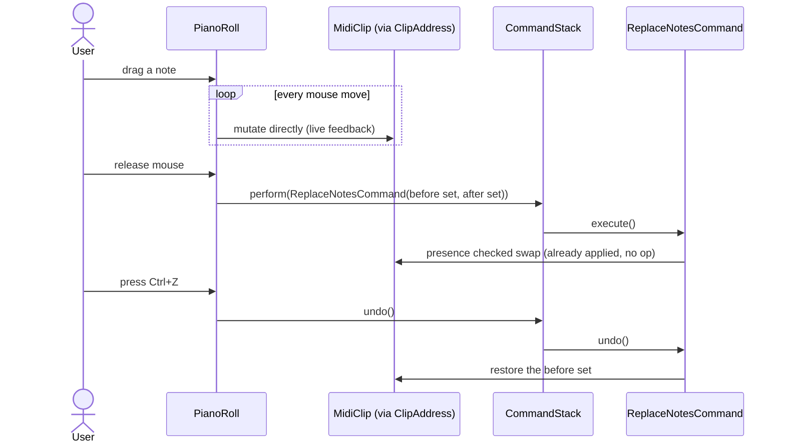
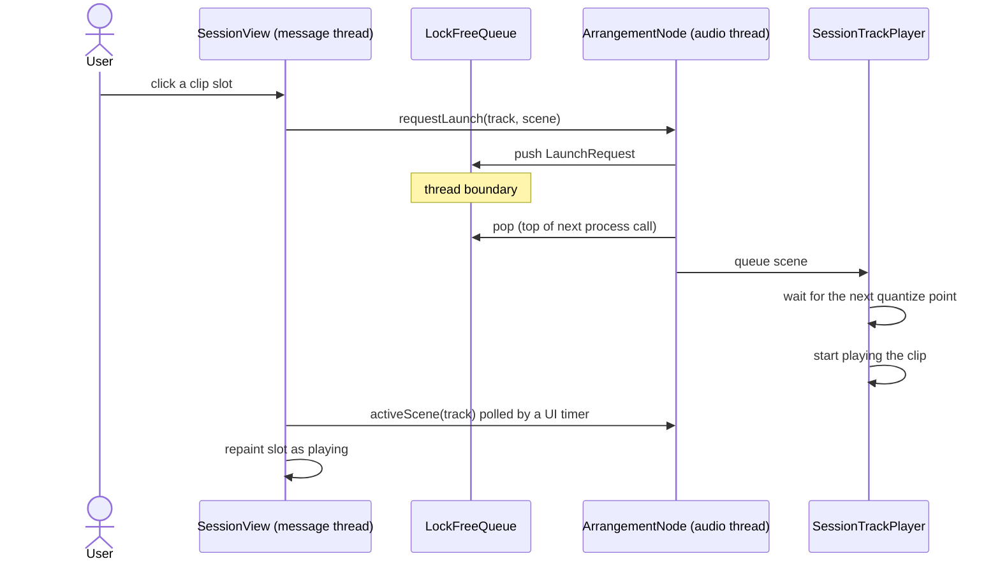
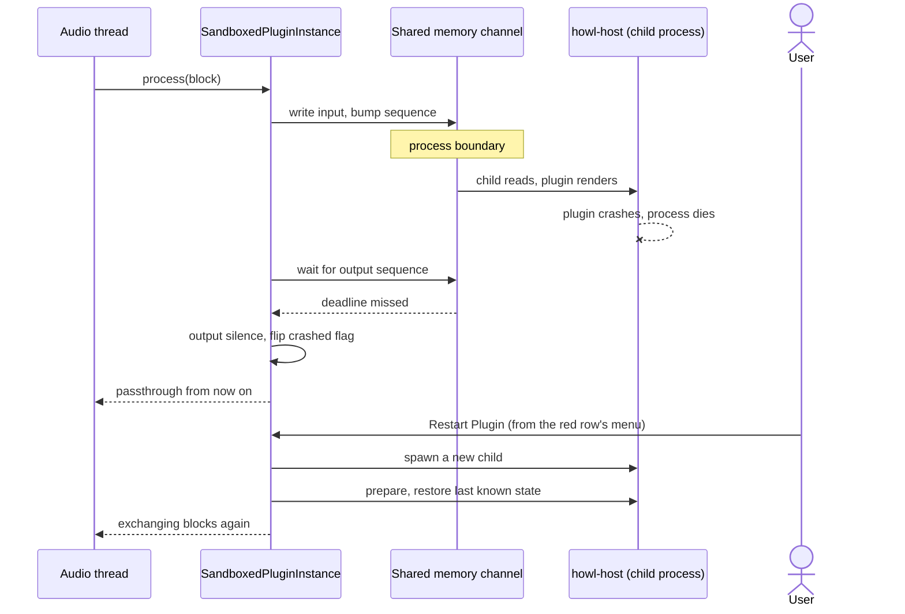
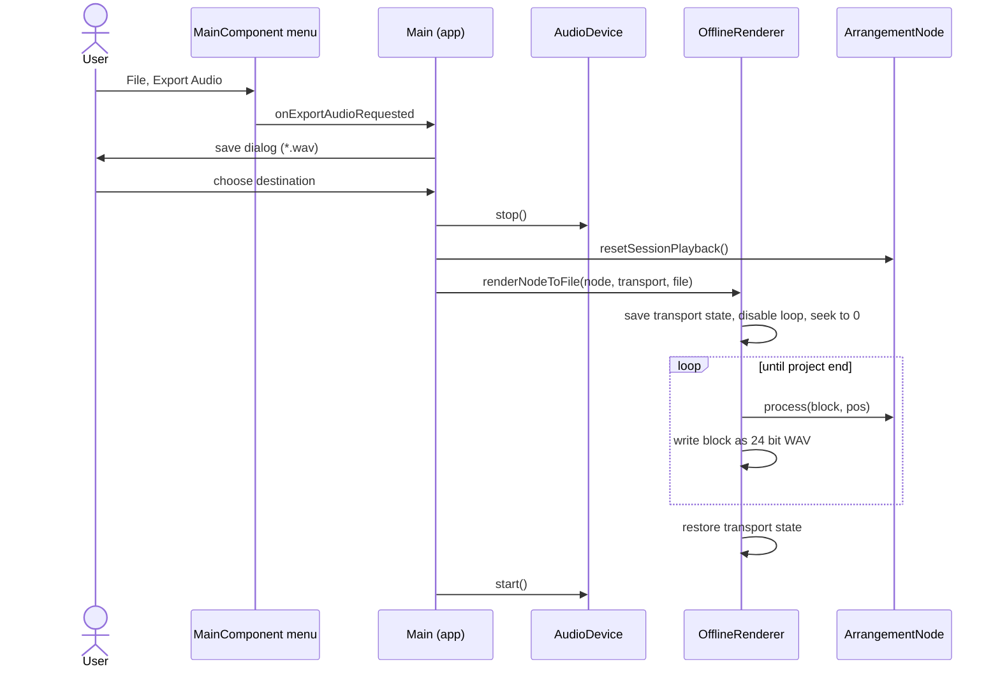
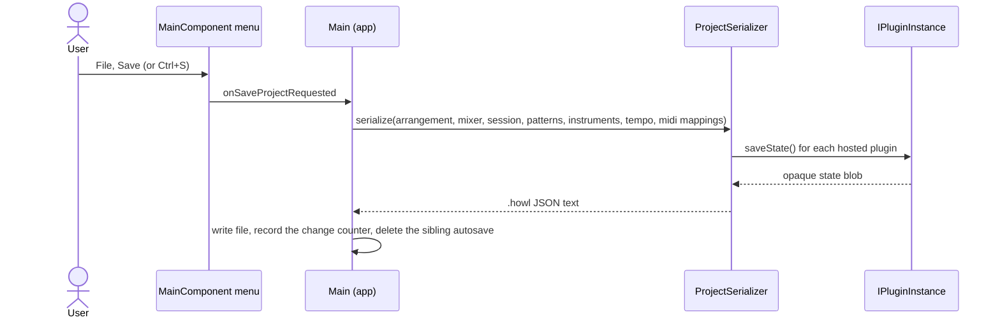

# Sequence diagrams

Six flows that show how the pieces talk to each other. Arrows crossing from the UI column to the engine columns are the interesting ones, because that is where thread and process boundaries live.

## 1. Rendering one audio block

The device calls back on the audio thread once per block. Everything below the device line is real time code.

## 2. Editing a note with undo

All on the message thread. The drag mutates the clip live so the user watches the real model move; mouse up turns the net change into one command whose execute is a harmless no op at that moment, and whose undo restores the values captured at mouse down.

## 3. Launching a session clip

The click happens on the message thread, the launch happens on the audio thread, and a lock free queue carries the request across.

## 4. A sandboxed plugin crashing and restarting

The plugin lives in its own process. The audio thread's wait on it is bounded, so a dead child costs one deadline, never a hang.

## 5. Exporting a WAV file

Export pauses the device, then reuses the exact playback code path offline, so what you hear is what you get.

## 6. Saving a project

